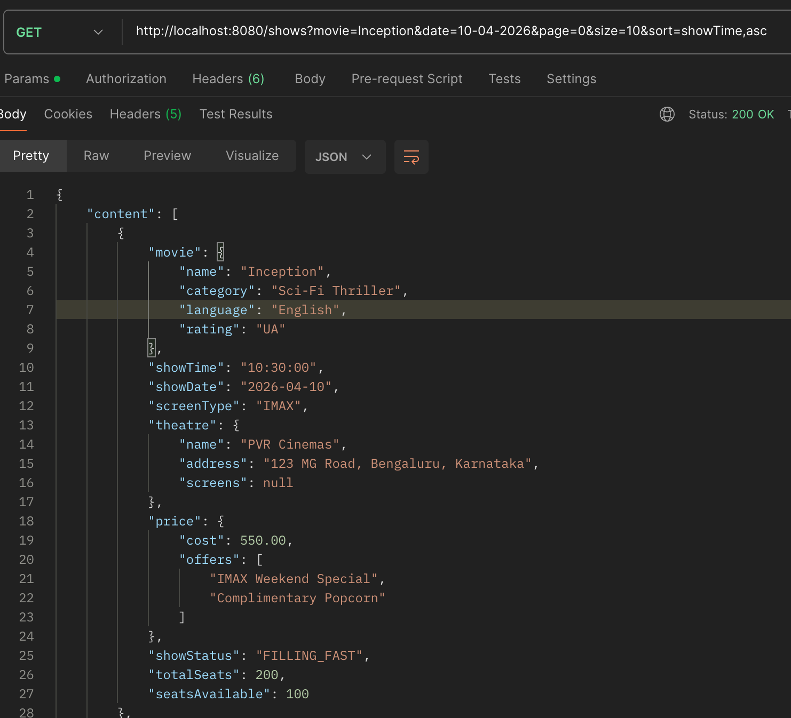
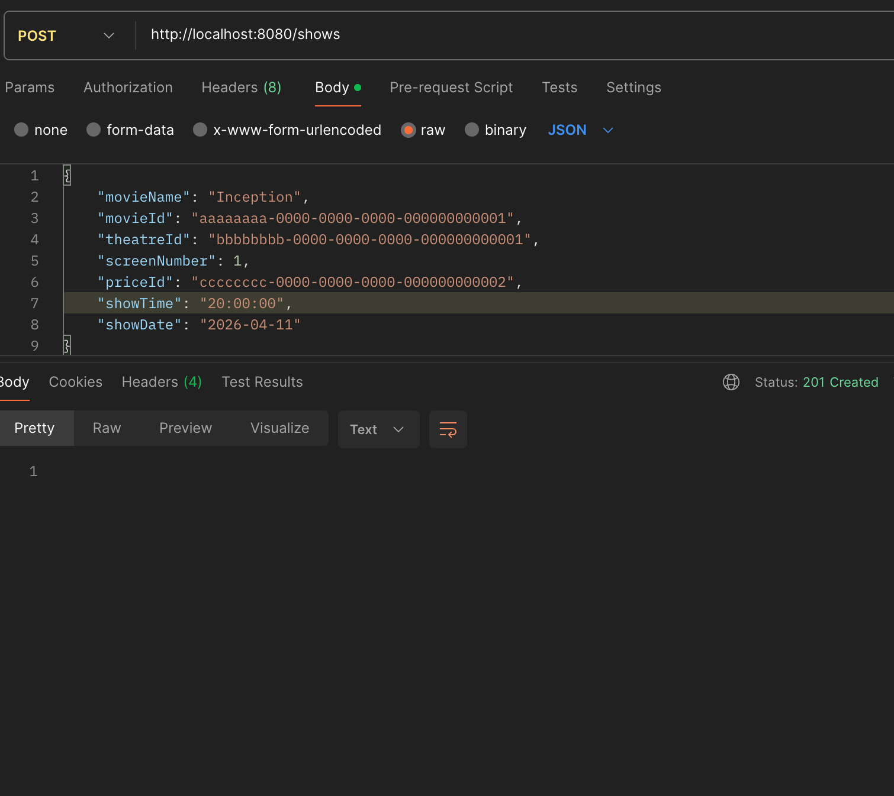
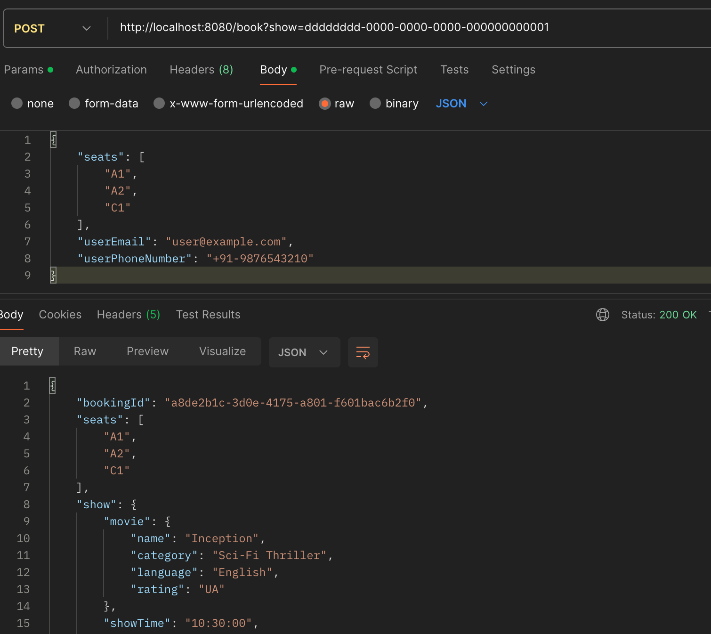
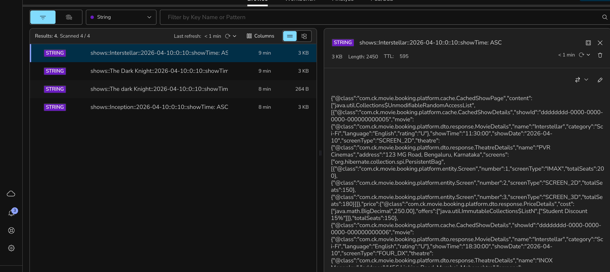
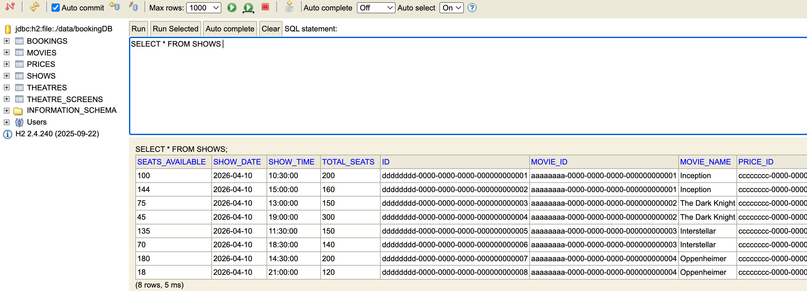

# Movie Booking Platform

## Building and Running

**Build**
```
./gradlew build
```

**Run**
```
./gradlew bootRun
```

The app starts on `http://localhost:8080`.

---

## Data Stores

**H2 (file-based database)**
Used as the primary relational database. The H2 console is available at `http://localhost:8080/h2-console` while the app is running. JDBC URL: `jdbc:h2:file:./data/bookingDB`.

**Redis (embedded)**
Used for caching with a TTL of 10 minutes. Redis is started automatically as an embedded server when the app boots via `EmbeddedRedisConfig` — no separate Redis installation or Docker is required. The embedded server starts on port `6379` and is shut down cleanly when the app stops.

---

## API Routes

### Get Shows

| Field   | Value                            |
|---------|----------------------------------|
| Method  | `GET`                            |
| URL     | `http://localhost:8080/shows`    |
| Headers | `Content-Type: application/json` |

| Query Param | Required | Format       | Example      |
|-------------|----------|--------------|--------------|
| `movie`     | Yes      | String       | `Inception`  |
| `date`      | Yes      | `dd-MM-yyyy` | `10-04-2026` |
| `page`      | No       | Integer      | `0`          |
| `size`      | No       | Integer      | `10`         |

---

### Add Show

| Field   | Value                            |
|---------|----------------------------------|
| Method  | `POST`                           |
| URL     | `http://localhost:8080/shows`    |
| Headers | `Content-Type: application/json` |

```json
{
  "movieName": "Inception",
  "movieId": "aaaaaaaa-0000-0000-0000-000000000001",
  "theatreId": "bbbbbbbb-0000-0000-0000-000000000001",
  "screenNumber": 1,
  "priceId": "cccccccc-0000-0000-0000-000000000001",
  "showTime": "10:30:00",
  "showDate": "2026-04-15"
}
```

---

### Book Show

| Field   | Value                            |
|---------|----------------------------------|
| Method  | `POST`                           |
| URL     | `http://localhost:8080/book`     |
| Headers | `Content-Type: application/json` |

| Query Param | Required | Format | Example                                |
|-------------|----------|--------|----------------------------------------|
| `show`      | Yes      | String | `dddddddd-0000-0000-0000-000000000001` |

```json
{
  "seats": ["A1", "A2"],
  "userEmail": "user@example.com",
  "userPhoneNumber": "9876543210"
}
```

---

## Features Implemented

### Get Shows
Fetches a paginated list of shows filtered by movie name and date. Results are cached in Redis with a 10-minute TTL so repeat queries for the same movie and date are served without hitting the database.

### Add Show
Creates a new show for a given movie, theatre, screen, and time slot. The screen type and total seat capacity are derived from the theatre's screen configuration. Show status (`EMPTY`, `FILLING_FAST`, `FEW_SEATS_REMAINING`) is calculated automatically based on seat availability.

### Book Show
Books seats for a show. The operation is marked `@Transactional` — seat availability is decremented and the show status is recalculated atomically. If the requested seat count exceeds availability, the entire operation is rolled back. A `Booking` record is persisted with the seat list, total cost (price per seat × number of seats), and user contact details.

### Architecture — DDD and Microservice-Ready Design
The platform is structured around distinct domain boundaries: `Movie`, `Theatre`, `Price`, `Show`, and `Booking` each have their own entity, repository, and service. No domain service reaches into another domain's repository directly — cross-domain data is fetched through the owning service. This means each domain can be extracted into its own microservice with minimal refactoring, needing only an HTTP or messaging client in place of the direct service call.

---

## Features Not Implemented
1. Booking platforms offers is not implemented. A placeholder String property offers has been introduced in PriceDetails, which can be extended towards offers.
2. update, and delete shows are not implemented. Only create and read operations are implemented for shows.
3. There is no separate Bulk booking feature introduced. But, the service and the entity are de-coupled from the controller layer, so it can be easily extended to support bulk booking in the future.
4. Theatres cannot allocate seat inventories. The Seat feature or entity has not been created. Just, integer property availableSeats.

---

## Test Results

### Get Shows


### Add Show


### Book Show


### Redis Cache


### H2 Console Data

